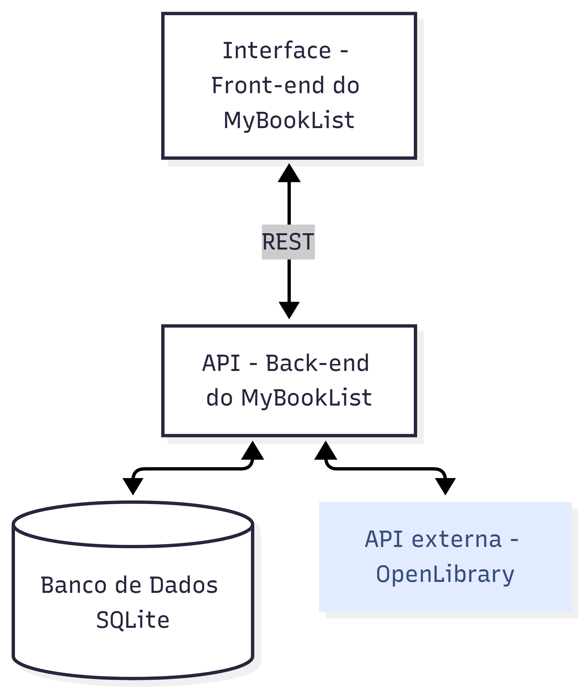

# MyBookList

Rede social para listar, salvar e descobrir livros.

## Rodar a aplicação

Após fazer download do projeto, somente é necessário abrir o arquivo **index.html** no navegador de preferência.

### Rodar pelo Docker

É necessário ter o [Docker](https://docs.docker.com/engine/install/) instalado e em execução.

Abrir o terminal como administrador no diretório que possui o arquivo **Dockerfile** e criar a imagem:

#### `docker build -t mybooklist-front .`

Em seguida, para rodar o projeto, execute o comando:

#### `docker run -p 5000:5000 mybooklist-front`

Para abrir a aplicação, basta acessar o link [http://localhost:5000/](http://localhost:5000/) no navegador.

## Fluxograma do projeto

